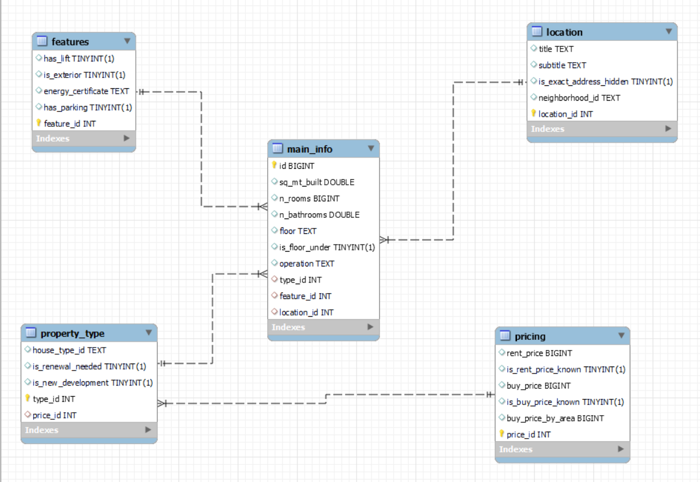

# Project IV : SQL/Tableau | Marco Ayora Arsic

## Introduction

In this project I will be showing how based on a dataset about the real state market in Madrid we can look for specific properties in Madrid thanks to SQL queries as well as having a bit of an idea of how the market is distributed geographically in terms of buy and rent prices thanks to Tableau.

## Data Source 

The data set was obtained by Kaggle, and the geojson file from the Madrid neighborhood was provided by a Spanish government  website.

## Methodology

The libraries used are the following:
- For data manipulation //import pandas as pd//import numpy as np

- In order to do the connection between our python notebook and mysql// import pymysql, import sqlalchemy as alch, from dotenv, import load_dotenv, from getpass import getpass

- To print in a more readable format //import pprint

## Overview

To see a global idea on how this project works we first have to look at the notebooks where the data frame was imported from the csv file downloaded from Kaggle. Then visualized to understand the data I was working on.

Then we pass to the cleaning notebook, in this part of the code we mainly prepare our data to be transferred  to Mysql in first place by getting rude of all the null values then separating the dataframe in 5 different dataframes. And finally creating the columns for this dataframes that will be later used for creating the primary and foreign keys in MySQL.
At the end of the notebook, it is observable how the 5 dataframes are imported into MySQL.

Once i had all the dataframes as tables in MySQL we had to do the connections by the keys seen in code and explained at the beginning of the Mysql file. This led us to have a SQL database that looks like this:

](images/image.png)

The first step to make use of this new SQL database was creating some queries to show how It can be used to look for the specific properties one can be looking for.  One example could be the last query where it first looks for a specific property based on its id and then gives the result of all the properties that are similar to the property based on the inputted parameters.

The second part of the project would be Tableau based where I imported the dataframe as a csv file before dividing it into 5 pieces. Then in order to use one of the columns I needed a spacial column with all the Madrid neighborhoods that I found in a Government web page. Then in tableau I separated my visualizations into 3 different spreadsheets.

## Tableau analysis

#### link for the Tableau file: https://public.tableau.com/app/profile/marco.ayora/viz/project4marco/Story1?publish=yes

In the first spreadsheet we can observe two same maps of all Madrid divided neighborhoods with its average rent and buy prices being in both 'Recolectos' the most centered one geographically as well as the most expensive.

In the second spreadsheet we first have in the left the average rent price with a filter only showing properties for rent above 1500€ visually displayed differently than before this time as tree map. Then in the right a box and whisker plot that displays the buy price per square meter built in each property so we can visualize some of the outliers too.

Finally, we can see two packed bubbles graphs that analyses the average buy and rent prices by the type of house. Having three different property types; apartments, duplex and penthouse. It is visually clear to state the differences between each while buying them as the penthouses lead the left graph but the renting prices do not vary that much between them. That could be due by two things; The lately increase in prices of housing in Spain or mistaken data from the dataset.

## Conclusion

Thanks to the data provided in this database and the tools used I created a lookalike system to navigate over the more than fifteen thousand properties by looking at its characteristics. In the other hand the fact that we miss lots of geographical data as well as past data of properties that have already been sold or rented in order to analyze the market makes our visualization lack consistency while it only helps us to understand the current available properties but not to analyze neither the future nor the past.

## Source links:

Madrid dataset: https://www.kaggle.com/datasets/mirbektoktogaraev/madrid-real-estate-market/

Spacial data: https://geoportal.madrid.es/IDEAM_WBGEOPORTAL/dataset.iam?id=422fa235-762b-11e9-861d-ecb1d753f6e8
